<p align="center">
  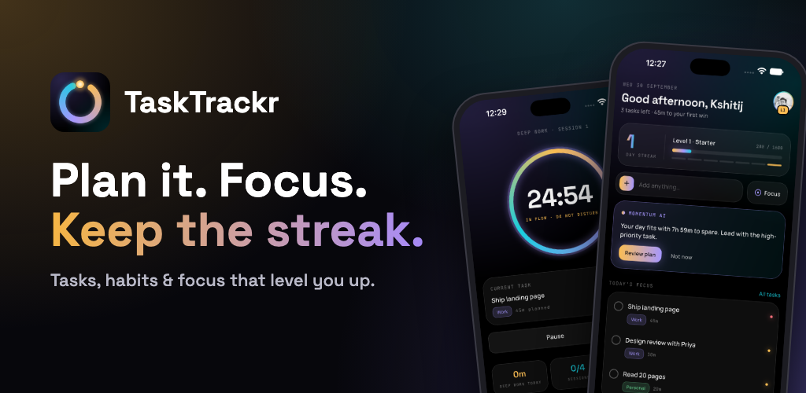
</p>

<p align="center">
  
</p>

<h1 align="center">TaskTrackr</h1>

<p align="center">
  <b>Plan it. Focus. Keep the streak.</b><br>
  Tasks, habits and focus sessions that bank XP. Built with Flutter and Firebase.
</p>

---

## Screenshots

<p align="center">
  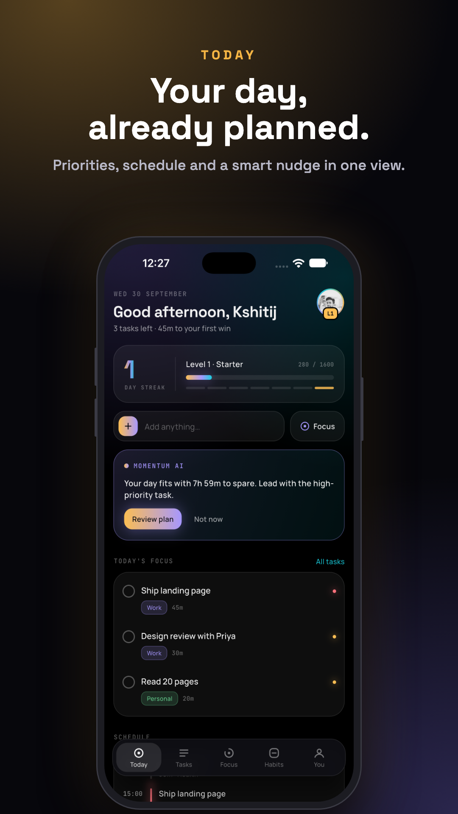
  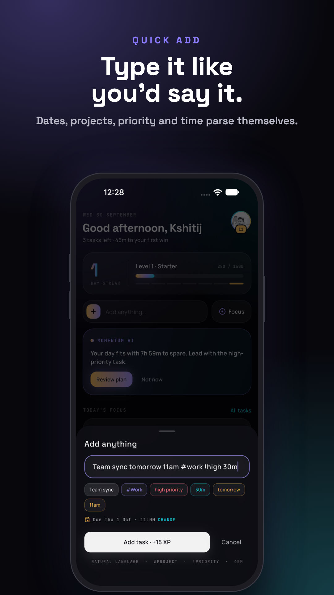
  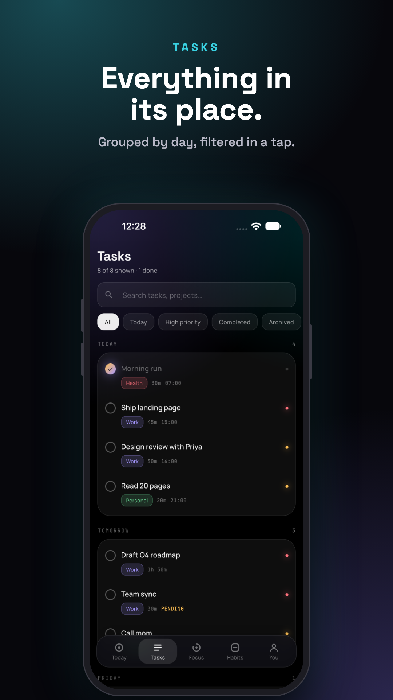
  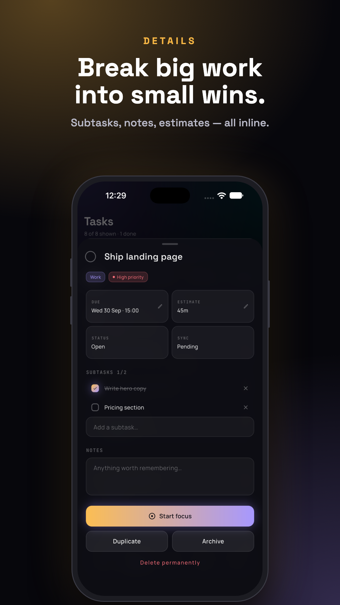
  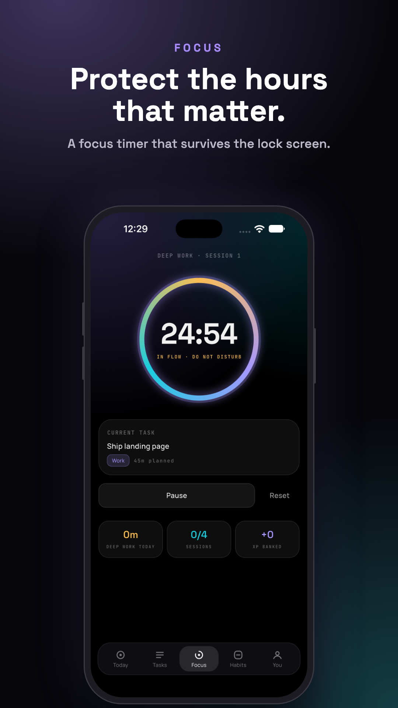
</p>
<p align="center">
  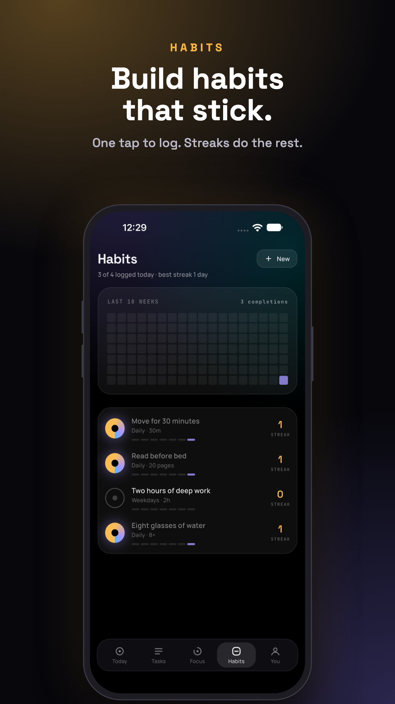
  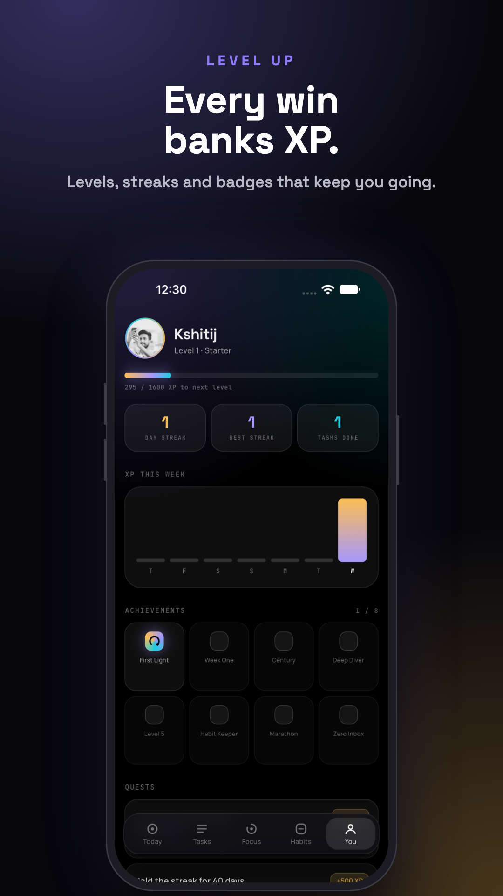
  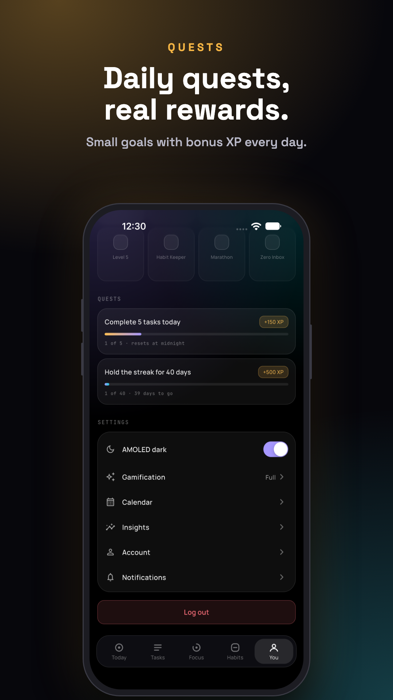
  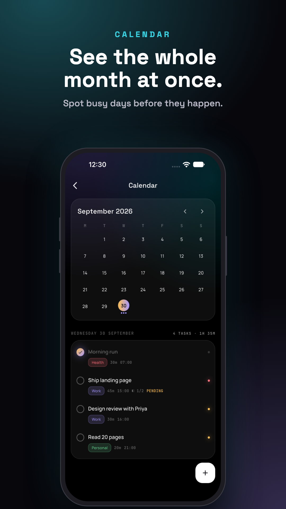
  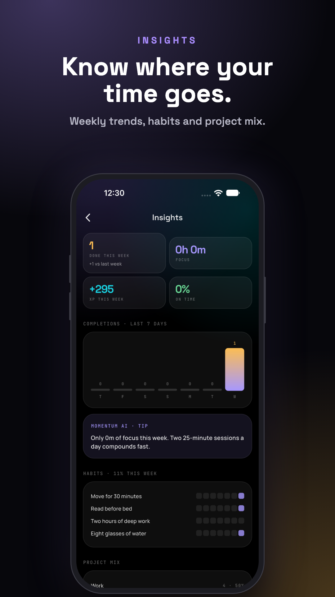
</p>

## Features

- **Today**: your priorities, schedule, habits and a planning nudge on one screen.
- **Natural-language quick add**: type `Team sync tomorrow 11am #work !high 30m` and the date, time, project, priority and estimate fill themselves in. Templates cover common tasks.
- **Tasks**: grouped by day, with search and filters for Today, High priority, Completed and Archived. Swipe to complete or archive, with undo.
- **Task details**: subtasks, notes, estimates, and inline editing of the due date and estimate.
- **Focus timer**: a 25-minute session tied to a task that keeps its time across restarts and the lock screen, and notifies you when it ends.
- **Habits**: log with one tap, track streaks, and see an 18-week history grid.
- **Gamification**: XP for tasks, habits, focus and capture, plus levels, day streaks, badges and daily and long-term quests. Choose Full, Quiet or Off.
- **Calendar**: a month view with task dots, day load and adding tasks to any day.
- **Insights**: weekly completions, focus time, XP, on-time rate, habit consistency and project mix, with a tip.
- **Reminders**: local notifications you can snooze or reschedule from the notification.
- **Sync and offline**: Firestore with offline persistence and pending-write indicators.
- **Account**: Google sign-in, profile photo, AMOLED dark theme and in-app account deletion.

## Tech stack

| Area | Choice |
|---|---|
| Framework | Flutter (Dart 3) |
| State | Riverpod 3 (hooks_riverpod) |
| Navigation | go_router |
| Backend | Firebase Auth, Cloud Firestore, Storage, Messaging |
| Sign-in | google_sign_in 7 |
| Notifications | flutter_local_notifications |
| Android | AGP 9, Gradle 9, Kotlin DSL, R8, minSdk 24, targetSdk 36 |

## Project structure

```
lib/
├── data/            # models, Firebase auth, notifications, repositories
├── presentation/
│   ├── screens/     # today, tasks, focus, habits, profile, calendar, insights…
│   ├── components/  # Momentum UI kit, task rows, sheets, rewards
│   └── providers/   # Riverpod providers (tasks, momentum/XP, planner, auth)
├── theme/           # Momentum design tokens, typography, motion
└── main.dart
firestore.rules      # owner-only security rules
store_assets/        # icon, feature graphic and store previews
```

## Getting started

**Prerequisites:** the Flutter SDK (stable), Xcode for iOS, Android Studio or an Android SDK, and the Firebase CLI.

```bash
git clone https://github.com/Kshitij-25/TaskTrackr.git
```

```bash
cd TaskTrackr && flutter pub get
```

```bash
flutter run
```

### Firebase

The Firebase config lives in `lib/firebase_options.dart`. To use your own project, run `flutterfire configure`. Then enable Google sign-in in Firebase Auth and add your SHA-1 fingerprints to the Android app.

Deploy the security rules:

```bash
firebase deploy --only firestore:rules
```

### Release build (Android)

Create `android/key.properties`. It is gitignored, so never commit it:

```properties
storeFile=src/your-keystore.jks
storePassword=…
keyAlias=…
keyPassword=…
```

```bash
flutter build appbundle --release
```

The bundle is written to `build/app/outputs/bundle/release/app-release.aab`.

## Privacy

Every task, habit and XP record belongs to the signed-in user. Firestore rules block access to anyone else's data. You can delete your account and all its data from **You → Account → Delete account**.

## Author

Built by [Kshitij Passi](https://github.com/Kshitij-25).
